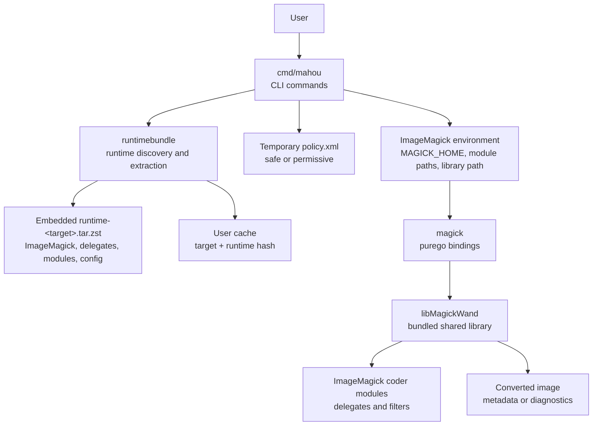
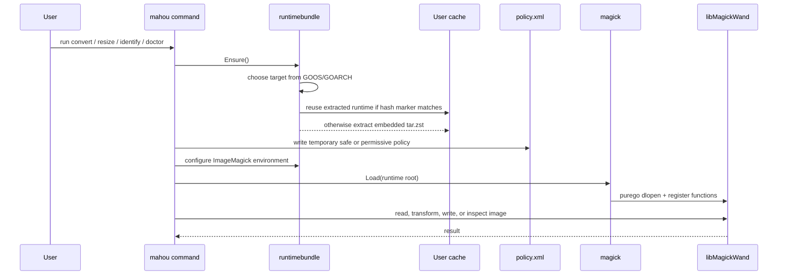

# mahou

[English](README.md)

`mahou` は、Go で作られたスタンドアロンの ImageMagick 7 CLI です。

ImageMagick 本体、delegate ライブラリ、coder module、設定ファイルを
1 つの Go バイナリに埋め込みます。初回実行時にユーザーキャッシュへ展開し、
[`purego`](https://github.com/ebitengine/purego) 経由で `libMagickWand` を呼び出します。
そのため、システムに ImageMagick をインストールせず、CGO なしで画像変換を実行できます。

## できること

- 主要な画像形式、プロ向け形式、ドキュメント形式の変換。
- アスペクト比を維持したリサイズ。
- 画像形式、サイズ、色深度などのメタデータ取得。
- バンドルされた ImageMagick が対応している形式の一覧表示。
- PDF、PS、EPS、MVG、MSL、URL、HTTP、HTTPS などをデフォルトでブロックする安全寄りの policy。
- **シームレスなパラメータ透過パススルー**: `mahou` に未登録のサブコマンドや引数（`-resize`, `-rotate`, `-crop` などの本家 ImageMagick の標準オプション）が渡された場合、内包された `magick` CLI を直接透過実行します。本家 `magick` コマンドの完全なドロップイン置換として機能します。

## 対応ターゲット

| OS | アーキテクチャ | ターゲット |
| --- | --- | --- |
| Linux | amd64 | `linux-amd64` |
| Linux | arm64 | `linux-arm64` |
| macOS | arm64 | `darwin-arm64` |

## クイックスタート

まず ImageMagick runtime bundle を作り、その後 Go CLI をビルドします。

```sh
# Linux の例
bash scripts/build-runtime-linux.sh linux-amd64 runtimebundle/assets/runtime-linux-amd64.tar.zst

# macOS の例
bash scripts/build-runtime-darwin.sh darwin-arm64 runtimebundle/assets/runtime-darwin-arm64.tar.zst

CGO_ENABLED=0 go build -o dist/mahou ./cmd/mahou
```

診断情報を確認します。

```sh
dist/mahou doctor --verbose
```

画像の確認、変換、リサイズを実行します。

```sh
dist/mahou identify input.png
dist/mahou convert input.heic output.webp
dist/mahou convert input.png output.jpg --quality 85 --strip
dist/mahou resize input.jpg output.webp --width 1200
```

## コマンド

`mahou` は、任意の ImageMagick パラメータを直接指定することで、本家の `magick` CLI と全く同じように使用できます。

最初の引数が以下のカスタムヘルパーコマンドのいずれかに一致する場合、内部で高速な Go 実装バージョンが実行されます：

| コマンド | 用途 |
| --- | --- |
| `mahou doctor [--verbose] [--json]` | runtime、ライブラリ、delegate、対応形式を診断します。 |
| `mahou formats [--json]` | バンドルされた ImageMagick に登録されている形式を一覧表示します。 |
| `mahou identify [options] input.png` | 画像メタデータを表示します（インプロセス高速Go版）。 |
| `mahou convert [options] input output` | 画像を別形式へ変換します（インプロセス高速Go版）。 |
| `mahou resize [options] input output --width N` | 幅を指定して、アスペクト比を維持したままリサイズします。 |
| `mahou exec [options] [args...]` | バンドルされた `magick` CLI を直接実行します（互換性のための明示的サブコマンド）。 |

### 共通オプション

| フラグ | 説明 |
| --- | --- |
| `--quality N` | 出力品質を指定します。多くの形式では `1` から `100` です。 |
| `--strip` | EXIF などのメタデータを削除します。 |
| `--auto-orient` | EXIF の向き情報を反映してから書き出します。 |
| `--format FMT` | 出力形式を明示的に指定します。 |
| `--json` | 対応コマンドの出力を JSON にします。 |
| `--verbose` | `doctor` で詳細な診断情報を表示します。 |
| `--policy safe\|permissive` | デフォルトの安全 policy、または全許可 policy を使います。 |
| `--unsafe-enable-pdf` | この実行だけ PDF、PS、EPS を有効化します。信頼できる入力では `--policy permissive` も使えます。 |

### ImageMagick パラメータの直接透過実行

`mahou` に認識されないサブコマンドやフラグ（`-resize`, `-rotate`, `-crop` などの標準的な ImageMagick のオプション）は、すべて内包された `magick` バイナリへ直接透過的に転送されます。これにより、`mahou` を本家 `magick` の代わりにそのまま使用することができます。

```sh
# 本家のImageMagickコマンドを直接実行する
dist/mahou input.png -resize 50% -rotate 90 output.png

# 複雑なフラグを指定して convert を透過実行する
dist/mahou convert input.png -colorspace Gray -background white -flatten output.jpg

# 透過実行時にセキュリティポリシーを適用する (mahou が事前に解釈しポリシーを構成します)
dist/mahou --policy permissive input.pdf -density 300 output.png
```

## アーキテクチャ



起動時の流れは次の通りです。



runtime はターゲットと bundle hash ごとにキャッシュされます。

- Linux: OS のユーザーキャッシュ配下。通常は `~/.cache/mahou/runtime`。
- macOS: `~/Library/Caches/mahou/runtime`。

## Runtime bundle の中身

`runtime-<target>.tar.zst` には、システムの ImageMagick に頼らず実行するためのファイルが入ります。

```text
bin/magick
lib/libMagickWand-7.*
lib/libMagickCore-7.*
lib/ImageMagick-*/modules-*/coders
lib/ImageMagick-*/modules-*/filters
etc/ImageMagick-7
lib/* delegate libraries
```

Go バイナリはこの archive を `//go:embed` で埋め込みます。展開先は SHA-256 hash
で決まるため、埋め込み runtime を更新すると自動的に新しいキャッシュディレクトリが使われます。

## 対応画像形式

正確な対応形式は、バンドルされた ImageMagick のビルド内容で決まります。次のコマンドで確認できます。

```sh
mahou formats
mahou doctor --verbose
```

代表的な対応形式は次の通りです。

| 分類 | 例 |
| --- | --- |
| Web / ラスター | JPEG, PNG, APNG, WebP, TIFF, GIF, BMP, ICO |
| モダン codec | HEIC, HEIF, AVIF, JXL |
| ベクター / ドキュメント | SVG, PDF, EPS, PS |
| プロ / 映像系 | EXR, PSD, PSB, DPX, CIN, HDR, FITS |
| JPEG 2000 | JP2, J2K, JPC, JPM |
| Netpbm | PBM, PGM, PPM, PNM, PAM, PFM |
| Camera RAW | DNG, CR2/CR3, NEF, ARW, ORF, RAF, RW2, PEF, SRW など |

### 本家ImageMagickとの違い

`mahou` はランタイムを内包したスタンドアロンのラッパーとして設計されており、通常のシステムインストールされた ImageMagick とはいくつかの重要な違いがあります。

1. **CLI機能の制限**: 本家 `magick` CLI を完全に置き換えるものではありません。メタデータの確認 (`identify`)、アスペクト比を維持した幅指定リサイズ (`resize`)、画像フォーマット変換 (`convert`)、登録フォーマット一覧 (`formats`)、環境診断 (`doctor`) などの基本機能のみを公開しています。複雑なフィルタパイプライン、画像の合成、描画 (`-draw`)、テキスト重ね合わせ (`-annotate`)、クロップや自由な回転などのフラグはサポートしていません。
2. **CGOフリーの動的ロード**: 実行時に `purego` を用いて、埋め込まれた `libMagickWand` 共有ライブラリを動的にロードします。これにより、ビルド時の CGO 制約が不要になりますが、実行動作は内包されたランタイムに依存します。
3. **環境の分離**: ライブラリのロード前に、実行プロセス用の主要な ImageMagick 環境変数 (`MAGICK_HOME`、`MAGICK_CODER_MODULE_PATH`、`MAGICK_FILTER_MODULE_PATH`、`MAGICK_CONFIGURE_PATH`、および `LD_LIBRARY_PATH` / `DYLD_LIBRARY_PATH`) を上書きまたは先頭に追加します。
4. **動的なセキュリティポリシーの適用**: システム全体の静的な `policy.xml` に依存せず、実行ごとに一時的なセキュリティポリシーを動的に書き込んで適用します。デフォルト (`--policy safe`) では危険な外部デリゲート呼び出しをブロックします。

### 既知の制限

| フォーマット・機能 | 制限内容 | 詳細 |
| --- | --- | --- |
| **PDF, PS, EPS** | 安全ポリシーおよび外部 Ghostscript への依存 | デフォルトの `--policy safe` ではブロックされます。有効化には `--policy permissive`（または `--unsafe-enable-pdf`）が必要で、さらに**読み込み・ラスタライズ**にはホストの `gs`（Ghostscript）バイナリが必要です。書き出しは単体で行えますが、適切なフォントやライブラリを持つ `gs` が対象システムに存在しない場合、読み込みは失敗します。 |
| **HEIC, HEIF, AVIF 書き込み** | エンコーダー・デリゲートの制限 | `libheif` を通じたデコード（読み込み）はフルサポートされますが、エンコーダー（`x265` や `aom`、`rav1e` など）の動的リンク構成によっては、書き出し（エンコード）が失敗するか未サポートとなる場合があります。 |
| **JXL (JPEG XL)** | macOS上でのコーダーモジュールのロード制限 | Linux では完全にサポートされますが、macOS では dynamic linker の挙動の制限により、`purego` / `libMagickWand` 経由での直接ロードが機能せず、macOS上でのテストではスキップされます。 |
| **Camera RAW** | OS制限および読み取り専用の制限 | Linux では `libraw` を用いた**デコード（読み取り専用）**に対応しています。macOS では、ビルド時の複雑さを回避するため、ランタイムが `--without-raw` で構成されており**一切サポートされません**。 |
| **SVG 書き込み** | ベクタライズバイナリへの依存 | ラスター画像をベクターの SVG 形式にベクタライズして変換（PNGからSVGへの変換など）するには、外部の `potrace` デリゲートバイナリが必要です。これはバンドルされていないため、ホストに `potrace` がインストールされていない限り失敗します。 |
| **動画フォーマット (MP4等)** | `ffmpeg` の非内包 | MP4, AVI, WEBM などの動画フォーマットの読み書きには外部の `ffmpeg` バイナリが必要です。内包されていないため、ホストに `ffmpeg` がインストールされており、かつ `--policy permissive` が有効である必要があります。 |

## 開発

テストを実行します。

```sh
go test ./...
```

runtime bundle を用意した後、CLI をビルドします。

```sh
CGO_ENABLED=0 go build -o dist/mahou ./cmd/mahou
```

このリポジトリには runtime bundle をコミットしません。CI では次のスクリプトでソースから作成します。

```sh
bash scripts/build-runtime-linux.sh linux-amd64 runtimebundle/assets/runtime-linux-amd64.tar.zst
bash scripts/build-runtime-darwin.sh darwin-arm64 runtimebundle/assets/runtime-darwin-arm64.tar.zst
```

CI は runtime archive をスクリプト内容の hash でキャッシュします。初回ビルドが重く、
変更がない場合はキャッシュを再利用します。

## ライブラリとしての利用

`mahou` は、Goのライブラリ（パッケージ）として自作プログラムにインポートして利用できます。ビルド時に `CGO_ENABLED=0` でコンパイル可能で、ホストシステムに ImageMagick をインストールしておく必要もありません。

```go
package main

import (
	"fmt"
	"log"
	"os"

	"github.com/yashikota/mahou/mahou"
	"github.com/yashikota/mahou/runtimebundle"
)

func main() {
	// 1. ランタイムが展開されているか確認し、ImageMagick用環境変数を初期化
	bundle, err := runtimebundle.Ensure()
	if err != nil {
		log.Fatalf("ランタイムの展開に失敗しました: %v", err)
	}
	
	// 一時的なセキュリティポリシーを適用 (PDFやURL読み込み等をブロックする安全設定)
	policyDir, err := runtimebundle.ApplyPolicy(false)
	if err != nil {
		log.Fatalf("ポリシーの作成に失敗しました: %v", err)
	}
	defer os.RemoveAll(policyDir)

	runtimebundle.ConfigureEnvironment(bundle.Root, policyDir)

	// 2. 共有ライブラリをロードして purego のバインドを初期化
	if _, err := mahou.Load(bundle.Root); err != nil {
		log.Fatalf("libMagickWandのロードに失敗しました: %v", err)
	}

	// 3. 画像変換を実行
	err = mahou.Convert("input.png", "output.webp", mahou.ConvertOptions{
		Quality: 85,
		Strip:   true,
	})
	if err != nil {
		log.Fatalf("画像変換に失敗しました: %v", err)
	}
	fmt.Println("画像変換が成功しました！")
}
```
