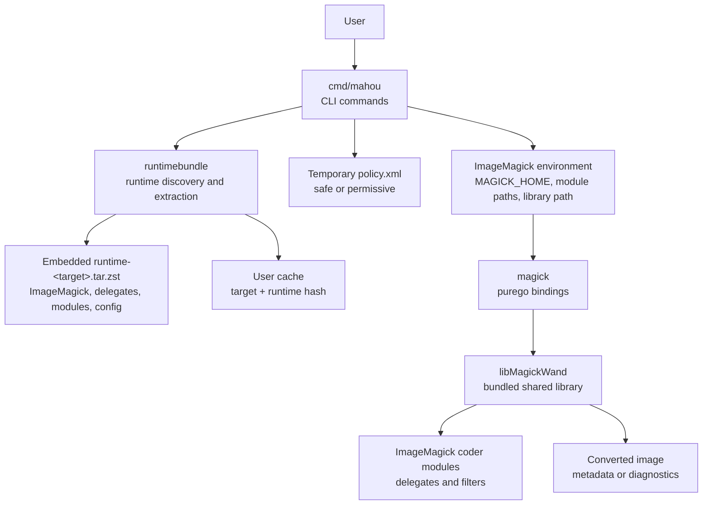
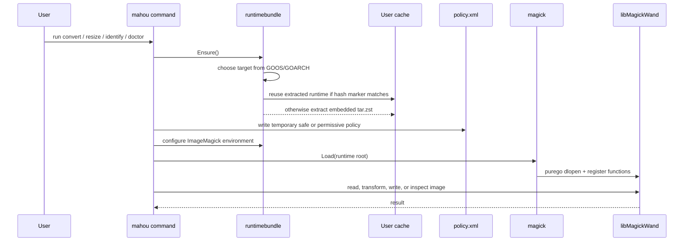

# mahou

[日本語版](README.ja.md)

`mahou` is a standalone ImageMagick 7 CLI built in Go.

It ships a complete ImageMagick runtime inside the binary, extracts that runtime
to the user cache on first use, and calls `libMagickWand` through
[`purego`](https://github.com/ebitengine/purego). The result is a portable image
tool with no system ImageMagick install and no CGO requirement.

## What it does

- Converts images between common and professional formats.
- Resizes images while preserving aspect ratio.
- Reads image metadata such as format, dimensions, color depth, and ImageMagick diagnostics.
- Lists supported formats from the bundled ImageMagick runtime.
- Uses a safe default policy that blocks risky formats and delegates such as PDF, PS, EPS, MVG, MSL, URL, HTTP, and HTTPS.
- **Transparent pass-through**: Falls back to the bundled ImageMagick CLI directly when unrecognized flags (like `-resize`, `-rotate`, or `-crop`) are passed, serving as a complete drop-in replacement for the `magick` CLI.

## Supported targets

| OS | Architecture | Target |
| --- | --- | --- |
| Linux | amd64 | `linux-amd64` |
| Linux | arm64 | `linux-arm64` |
| macOS | arm64 | `darwin-arm64` |

### System requirements

| Platform | Minimum version |
| --- | --- |
| Linux | GLIBC 2.36 (Debian 12 / Ubuntu 22.04 / RHEL 9 or later) |
| macOS | macOS 14 Sonoma or later |

## Quick start

Build a runtime bundle, then build the Go CLI:

```sh
# Linux example
bash scripts/build-runtime-linux.sh linux-amd64 runtimebundle/assets/runtime-linux-amd64.tar.zst

# macOS example
bash scripts/build-runtime-darwin.sh darwin-arm64 runtimebundle/assets/runtime-darwin-arm64.tar.zst

CGO_ENABLED=0 go build -o dist/mahou ./cmd/mahou
```

Run diagnostics:

```sh
dist/mahou doctor --verbose
```

Convert and resize images:

```sh
dist/mahou identify input.png
dist/mahou convert input.heic output.webp
dist/mahou convert input.png output.jpg --quality 85 --strip
dist/mahou resize input.jpg output.webp --width 1200
```

## Commands

`mahou` can be used exactly like the original `magick` CLI by passing any ImageMagick parameters directly.

If the first argument matches one of the custom helper commands, it runs the fast in-process Go version:

| Command | Purpose |
| --- | --- |
| `mahou doctor [--verbose] [--json]` | Show runtime, library, delegate, and format diagnostics. |
| `mahou formats [--json]` | List formats registered by the bundled ImageMagick runtime. |
| `mahou identify [options] input.png` | Print image metadata (fast in-process Go version). |
| `mahou convert [options] input output` | Convert one image to another format (fast in-process Go version). |
| `mahou resize [options] input output --width N` | Resize to a target width with aspect ratio preserved. |
| `mahou exec [options] [args...]` | Run the bundled `magick` CLI directly (legacy/explicit subcommand). |

### Common options

| Flag | Description |
| --- | --- |
| `--quality N` | Output quality, usually `1` to `100`, depending on the format. |
| `--strip` | Remove EXIF and other metadata. |
| `--auto-orient` | Apply EXIF orientation before writing. |
| `--format FMT` | Override the output format. |
| `--json` | Print JSON output for commands that support it. |
| `--verbose` | Print extended diagnostics for `doctor`. |
| `--policy safe\|permissive` | Use the safe default policy or allow all ImageMagick policies. |
| `--unsafe-enable-pdf` | Enable PDF, PS, and EPS handling for this run. Prefer `--policy permissive` for trusted inputs. |

### Direct ImageMagick Command Pass-through

Any unrecognized subcommand or flag (such as standard ImageMagick options like `-resize`, `-rotate`, `-crop`) will be forwarded directly to the bundled ImageMagick binary. This allows `mahou` to act as a drop-in replacement for the `magick` CLI:

```sh
# Run standard ImageMagick commands directly
dist/mahou input.png -resize 50% -rotate 90 output.png

# Forward convert with complex flags
dist/mahou convert input.png -colorspace Gray -background white -flatten output.jpg

# Set safety policy on direct commands (extracted automatically by mahou)
dist/mahou --policy permissive input.pdf -density 300 output.png
```

## Architecture



Startup flow:



The runtime is cached by target and bundle hash:

- Linux: under the OS user cache directory, usually
  `~/.cache/mahou/runtime`.
- macOS: `~/Library/Caches/mahou/runtime`.

## Runtime contents

Each `runtime-<target>.tar.zst` contains the pieces required to run
ImageMagick without a system install:

```text
bin/magick
lib/libMagickWand-7.*
lib/libMagickCore-7.*
lib/ImageMagick-*/modules-*/coders
lib/ImageMagick-*/modules-*/filters
etc/ImageMagick-7
lib/* delegate libraries
```

The Go binary embeds that archive with `//go:embed`. Runtime extraction is
content-addressed by SHA-256, so updating the embedded archive creates a new
cache directory automatically.

## Supported image formats

The exact format list comes from the bundled ImageMagick build. Check it with:

```sh
mahou formats
mahou doctor --verbose
```

Commonly supported formats include:

| Category | Examples |
| --- | --- |
| Web and raster | JPEG, PNG, APNG, WebP, TIFF, GIF, BMP, ICO |
| Modern codecs | HEIC, HEIF, AVIF, JXL |
| Vector and documents | SVG, PDF, EPS, PS |
| Professional and cinema | EXR, PSD, PSB, DPX, CIN, HDR, FITS |
| JPEG 2000 | JP2, J2K, JPC, JPM |
| Netpbm | PBM, PGM, PPM, PNM, PAM, PFM |
| Camera RAW | DNG, CR2/CR3, NEF, ARW, ORF, RAF, RW2, PEF, SRW, and others |

### Differences from Original ImageMagick

`mahou` is designed as a standalone wrapper with a bundled runtime and has several key differences from a standard system-installed ImageMagick:

1. **CLI Capabilities**: It is **not** a drop-in replacement for the `magick` CLI. It only exposes basic features: metadata identification (`identify`), resizing by width with aspect ratio preservation (`resize`), format conversion (`convert`), format listing (`formats`), and environmental diagnostics (`doctor`). It does not support complex filter pipelines, image composition, drawing, text annotations, cropping, or rotation flags.
2. **CGO-Free Dynamic Loading**: It uses `purego` to dynamically load the bundled `libMagickWand` shared library at runtime. This avoids compile-time CGO requirements but makes execution dependent on the embedded runtime.
3. **Environment Isolation**: On startup, it overrides or prepends critical ImageMagick environment variables (like `MAGICK_HOME`, `MAGICK_CODER_MODULE_PATH`, `MAGICK_FILTER_MODULE_PATH`, `MAGICK_CONFIGURE_PATH`, and `LD_LIBRARY_PATH` / `DYLD_LIBRARY_PATH`) for the running process.
4. **Dynamic Security Policies**: Instead of reading system-wide configurations, it generates and applies a temporary strict security policy (`--policy safe`) by default to prevent execution of unbundled external delegates.

### Known Limitations

| Format or Feature | Limitation | Details |
| --- | --- | --- |
| **PDF, PS, EPS** | Safe Policy & External Ghostscript dependency | Blocked by default under `--policy safe`. Requires `--policy permissive` (or `--unsafe-enable-pdf`) and relies on `gs` (Ghostscript) for **reading/rasterization**. While writing is done internally, reading will fail if a functional `gs` binary with proper fonts/libraries is missing on the target host. |
| **HEIC, HEIF, AVIF Write** | Encoder/Delegate limitations | Decoding (reading) is fully supported via `libheif`. However, encoding (writing) may fail or be unsupported depending on how encoders (`x265`, `aom`, `rav1e`) are dynamically linked. |
| **JXL (JPEG XL)** | macOS Coder Module loading | Fully supported on Linux. On macOS, direct loading of the JXL coder module via `purego` / `libMagickWand` is unsupported due to dynamic linker behaviors and is skipped in tests. |
| **Camera RAW** | OS and Read-Only limitations | On Linux, supported for **read-only** (decoding only) via `libraw`. On macOS, it is **not supported at all** because the macOS runtime build script configures ImageMagick with `--without-raw`. |
| **SVG Write** | Vectorization binary dependency | Writing a raster image to vector SVG format requires the external `potrace` delegate binary. Since `potrace` is not bundled, vectorization on write will fail unless `potrace` is pre-installed on the host. |
| **Video Formats (MP4, etc.)** | Unbundled `ffmpeg` | Reading/writing video formats (like MP4, AVI, WEBM) requires the external `ffmpeg` binary. Because `ffmpeg` is not bundled, video operations will fail unless `ffmpeg` is installed on the host and `--policy permissive` is active. |

## Development

Run tests:

```sh
go test ./...
```

Build the CLI after preparing a runtime bundle:

```sh
CGO_ENABLED=0 go build -o dist/mahou ./cmd/mahou
```

The repository does not commit runtime bundles. CI builds them from source with:

```sh
bash scripts/build-runtime-linux.sh linux-amd64 runtimebundle/assets/runtime-linux-amd64.tar.zst
bash scripts/build-runtime-darwin.sh darwin-arm64 runtimebundle/assets/runtime-darwin-arm64.tar.zst
```

CI caches runtime archives by script content hash, so the first runtime build is
the slow path and unchanged builds reuse the cache.

## Library Usage

`mahou` can be imported as a Go library. It requires `CGO_ENABLED=0` to build and doesn't require ImageMagick to be installed on the host system.

```go
package main

import (
	"fmt"
	"log"
	"os"

	"github.com/yashikota/mahou/mahou"
	"github.com/yashikota/mahou/runtimebundle"
)

func main() {
	// 1. Ensure the runtime is extracted and configure the environment
	bundle, err := runtimebundle.Ensure()
	if err != nil {
		log.Fatalf("failed to ensure runtime: %v", err)
	}
	
	// Apply the default safe policy (blocking PDF, URL, etc.)
	policyDir, err := runtimebundle.ApplyPolicy(false)
	if err != nil {
		log.Fatalf("failed to apply policy: %v", err)
	}
	defer os.RemoveAll(policyDir)

	runtimebundle.ConfigureEnvironment(bundle.Root, policyDir)

	// 2. Load the shared library
	if _, err := mahou.Load(bundle.Root); err != nil {
		log.Fatalf("failed to load libMagickWand: %v", err)
	}

	// 3. Convert an image
	err = mahou.Convert("input.png", "output.webp", mahou.ConvertOptions{
		Quality: 85,
		Strip:   true,
	})
	if err != nil {
		log.Fatalf("conversion failed: %v", err)
	}
	fmt.Println("Conversion successful!")
}
```
